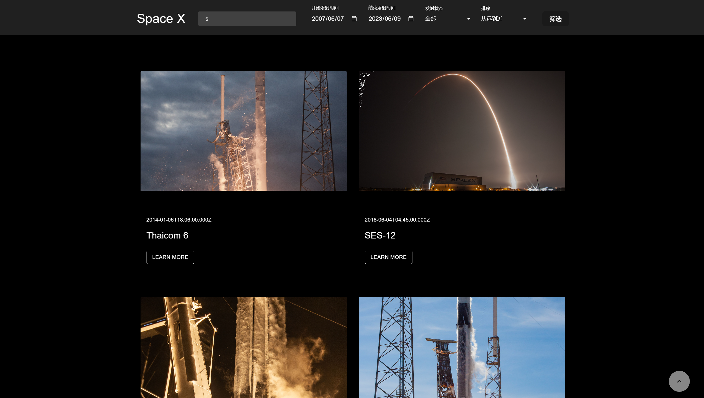
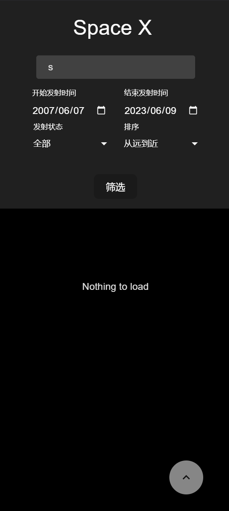

# Space X api
由于没有路由等需求，在App处即为程序逻辑，文章详情查看采用MUI Drawer的交互，保留每次查看详情时的列表位置。为了方便查询，起始日期给了默认值。

## 技术选型

* 组件 MUI
* 语言 Typescript
* 图片懒加载 + 占位 react-lazy-load-image-component
* 数据加载 useInfiniteQuery + IntersectionObserver 做分页
* 包管理工具 pnpm

## 搜索测试用例

* name: s 

* name: t  launchStatus : false 

## 项目截图

